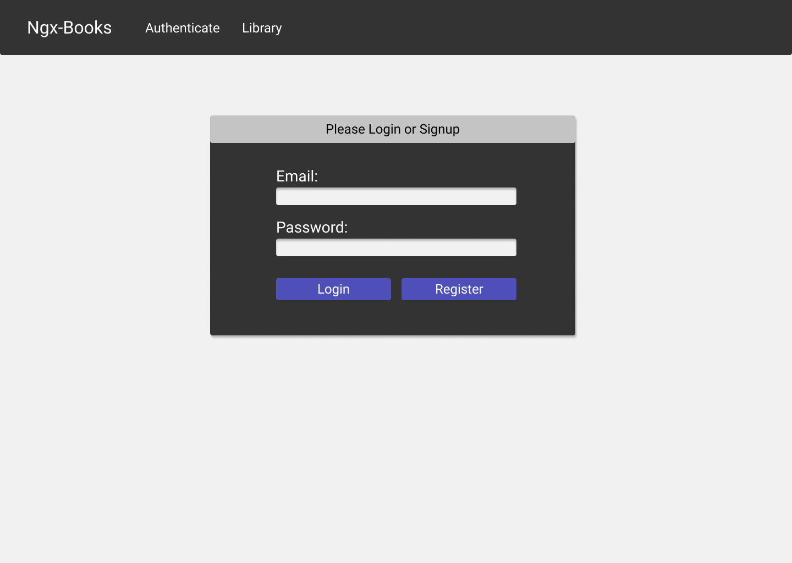
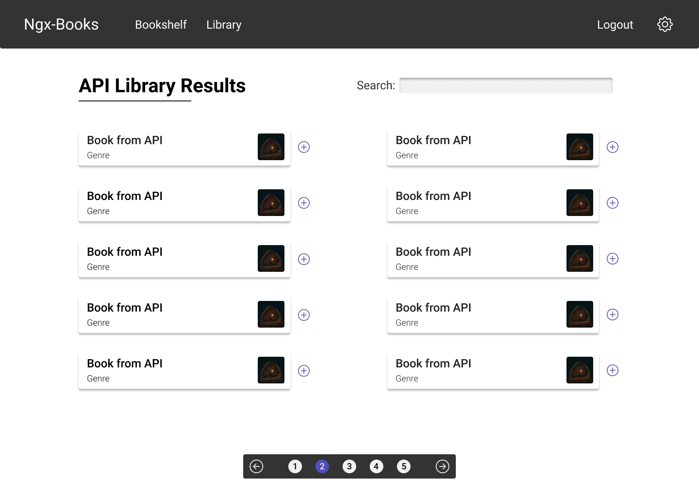

# Class 4 - Course Basics && Debugging

---

## Steps

### Planning the Application

**What are the features?**


**What is the Design/UI flow?**






### Starting a New Project

```zsh
    ng new angulearn --no-strict

    npm install --save bootstrap@4
```

1. Import "node_modules/bootstrap/dist/css/bootstrap.min.css" in angular.json under "styles" tag.
2. Clear App component HTML.
3. Test For Bootstrap by adding a container div with a row and column with text inside.

```zsh
    ng serve
```

### Add Starting Components & File Structure

```zsh
    ng g c navigation --skip-tests=true

    ng g c bookshelf --skip-tests=true

    ng g c library --skip-tests=true
```

- Add shared folder
- Add `<app-navigation></app-navigation>` to App Component above the row.

```zsh
    ng g c bookshelf/book-list --skip-tests=true

    ng g c bookshelf/book-details --skip-tests=true

    ng g c bookshelf/shared/book --skip-test=true

    ng g c library/book-search --skip-tests=true

    ng g c library/book-results --skip-tests=true
```

- Make sure they are all uploaded in app.module.ts

### Displaying Your Components

- Add the bookshelf component and library component to your main app file inside of the column you previously created.
- Inside the bookshelf component, add a row and 2 columns with the book-list & book-details components.
- Inside the library component, add a row and 2 columns with the book-search & book-results components.
- In the book-list components html file, add the 3 book components.
- In the library component html file, add a row with a book-search column, an hr, the book-results column.

### Adding Navigation to the App

- a
