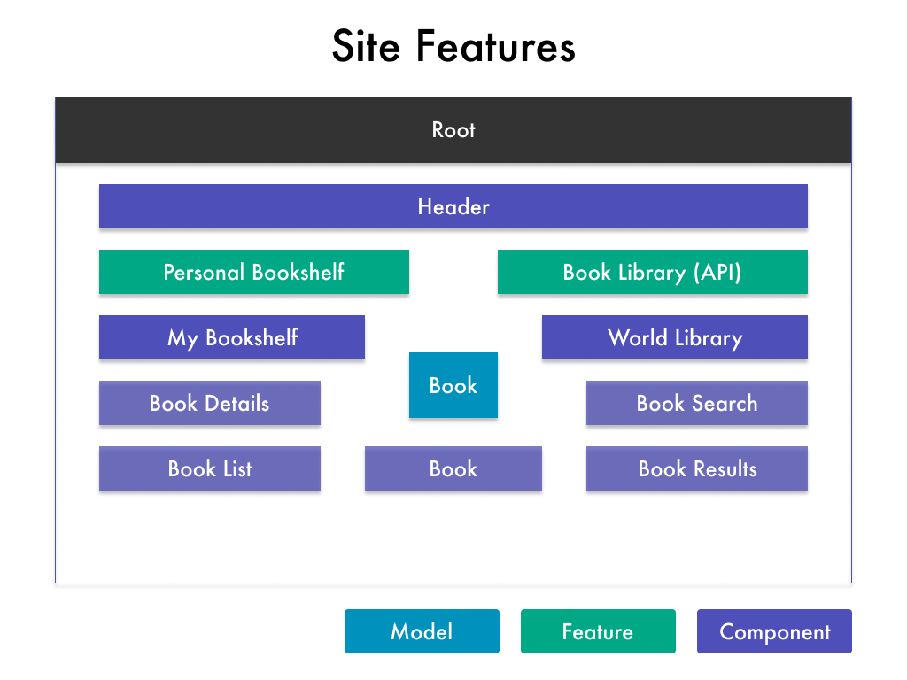

# Class 4 - Course Basics && Debugging

---

## Steps

### Planning the Application

**What are the features?**



**What is the Design/UI flow?**


### Starting a New Project

```zsh
    ng new angulearn --no-strict

    npm install --save bootstrap@4
```

1. Import "node_modules/bootstrap/dist/css/bootstrap.min.css" in angular.json under "styles" tag.
2. Clear App component HTML.
3. Test For Bootstrap by adding a container div with a row and column with text inside.

```zsh
    ng serve
```

### Add Starting Components & File Structure

```zsh
    ng g c navigation --skip-tests=true

    ng g c bookshelf --skip-tests=true

    ng g c library --skip-tests=true
```

- Add shared folder
- Add `<app-navigation></app-navigation>` to App Component above the row.

```zsh
    ng g c bookshelf/book-list --skip-tests=true

    ng g c bookshelf/book-details --skip-tests=true

    ng g c shared/book --skip-test=true

    ng g c library/book-search --skip-tests=true

    ng g c library/book-results --skip-tests=true
```

- Make sure they are all uploaded in app.module.ts

### Displaying Your Components

- Add the bookshelf component and library component to your main app file inside of the column you previously created.
- Inside the bookshelf component, add a row and 2 columns with the book-list & book-details components.
- Inside the library component, add a row and 2 columns with the book-search & book-results components.
- In the book-list components html file, add 3 book components.
- In the book-results component, add 3 book components.

### Adding Navigation to the App

- Create a nav element with navbar, navbar-dark and bg-dark classes.
- Create collapse menu.
- Create basic links.
- Create dropdown toggler.

### Adding the Book Model and Instantiations

- Create book.model.ts file as a class with a constructor.
- Add myBooks array in Book-List Component with the type Book[].
- Create a dummy book inside of the myBooks array using the "new" keyword.
- In the Book-List Component HTML file, add an ngFor loop to display all books in the myBooks array and a Add New Book Button.
- Test that this works by adding more books in the myBooks array.
- Add the Dynamic Title, Genre, and Image variables.

### Creating the Book Details

- Add rows for the title, author, genre, image, tags, and edit book button.

### Working on the Libary Page

- Copy over the book-list html and paste in the library/book-results html. _Be sure to mention DRY Coding and why we shouldn't have two components doing basically the same thing... and that we will eventually put this logic in the book component!!_
- Change into two rows if you have time... make sure to delete the "Add New Book Button".

### Debugging an Angular App

- Make sure they understand the importance of using the chrome developer tools console, reading error messages, using console.log and walking through their code line by line to "follow the logic".
- Show them how to debug using the browser sourcemaps / debugger tool (Source => Webpack => . => Src).

---

#### Extra Time

- Add Roboto Font.
- Split the Library Results into two columns / arrays
- Refactor the book.module.ts file to make it all happen in the constructor argument field.
- Add styles to navbar and container.
